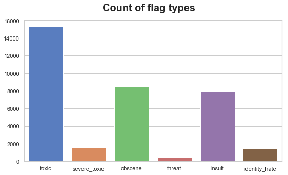
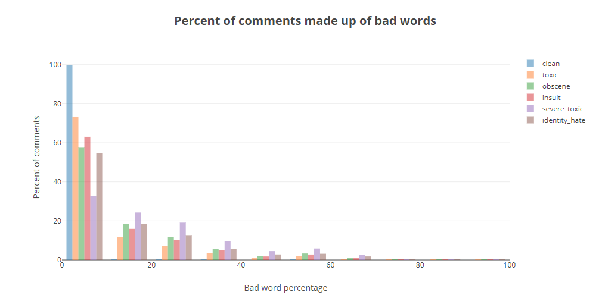
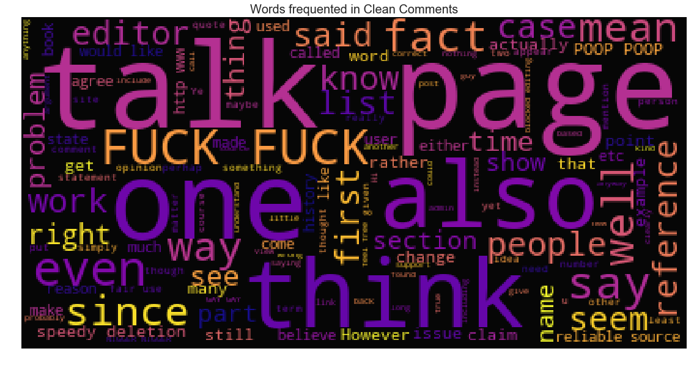

# Toxic Comment Classification Challenge

This is an exercise to help me understand more about natural language processing, feature engineering, data cleansing and visualization in Python.

## About the Data

In this competition, you’re challenged to build a multi-headed model that’s capable of detecting different types of toxicity like threats, obscenity, insults, and identity-based hate better than Perspective’s current models. You’ll be using a dataset of comments from Wikipedia’s talk page edits. Improvements to the current model will hopefully help online discussion become more productive and respectful. The types of toxicity are:

**toxic**

**severe_toxic**

**obscene**

**threat**

**insult**

**identity_hate**

You must create a model which predicts a probability of each type of toxicity for each comment.

_Disclaimer: the dataset for this competition contains text that may be considered profane, vulgar, or offensive._

The data contained the following files:

**train.csv** - the training set, contains comments with their binary labels

**test.csv** - the test set, you must predict the toxicity probabilities for these comments. To deter hand labeling, the test set contains some comments which are not included in scoring.

**sample_submission.csv** - a sample submission file in the correct format

Data and a more detailed description can be found [here](https://www.kaggle.com/c/jigsaw-toxic-comment-classification-challenge/data):

## Find Analysis notebook [here](notebooks/Analysis.ipynb)

## Interesting Plots

## Findings/things of note

- Clean comments rarely have bad words contained
- Clean comments aren't written in ALL CAPS as often as flagged comments

## Libraries used:

- pandas
- numpy
- scikit-learn
- matplotlib
- seaborn
- plotly
- nltk
- wordcloud
- scipy
- spaCy
- xgboost

Project Organization
------------

    ├── LICENSE
    ├── Makefile           <- Makefile with commands like `make data` or `make train`
    ├── README.md          <- The top-level README for developers using this project.
    ├── data
    │   ├── external       <- Data from third party sources.
    │   ├── interim        <- Intermediate data that has been transformed.
    │   ├── processed      <- The final, canonical data sets for modeling.
    │   └── raw            <- The original, immutable data dump.
    │
    ├── docs               <- A default Sphinx project; see sphinx-doc.org for details
    │
    ├── models             <- Trained and serialized models, model predictions, or model summaries
    │
    ├── notebooks          <- Jupyter notebooks. Naming convention is a number (for ordering),
    │                         the creator's initials, and a short `-` delimited description, e.g.
    │                         `1.0-jqp-initial-data-exploration`.
    │
    ├── references         <- Data dictionaries, manuals, and all other explanatory materials.
    │
    ├── reports            <- Generated analysis as HTML, PDF, LaTeX, etc.
    │   └── figures        <- Generated graphics and figures to be used in reporting
    │
    ├── requirements.txt   <- The requirements file for reproducing the analysis environment, e.g.
    │                         generated with `pip freeze > requirements.txt`
    │
    ├── src                <- Source code for use in this project.
    │   ├── __init__.py    <- Makes src a Python module
    │   │
    │   ├── data           <- Scripts to download or generate data
    │   │   └── make_dataset.py
    │   │
    │   ├── features       <- Scripts to turn raw data into features for modeling
    │   │   └── build_features.py
    │   │
    │   ├── models         <- Scripts to train models and then use trained models to make
    │   │   │                 predictions
    │   │   ├── predict_model.py
    │   │   └── train_model.py
    │   │
    │   └── visualization  <- Scripts to create exploratory and results oriented visualizations
    │       └── visualize.py
    │
    └── tox.ini            <- tox file with settings for running tox; see tox.testrun.org

--------

<small>Project based on the <a target="_blank" href="https://drivendata.github.io/cookiecutter-data-science/">cookiecutter data science project template</a>. #cookiecutterdatascience</small>

